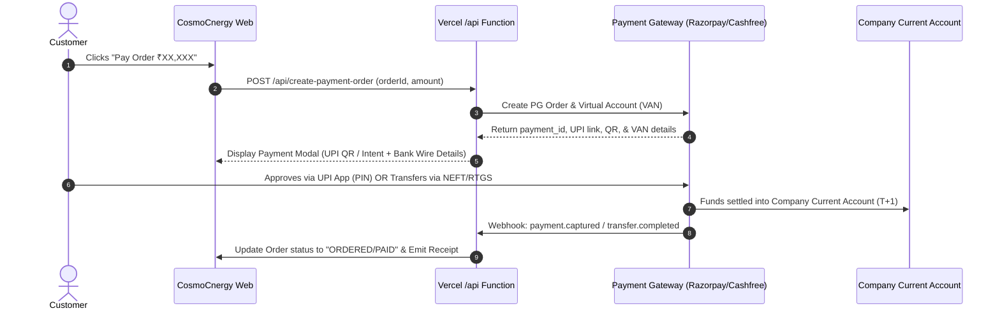

# Brainstorming & Architecture Exploration: UPI & Direct Bank Transfer Integration

## 1. Problem Statement & Core Goals
We want to integrate an automated, seamless payment system for **CosmoCnergy** directly interlinked with the company's bank account.
Customers / procurement partners should be able to make payments in just a few clicks via:
1. **UPI Instant Checkout** (Dynamic QR code on desktop + 1-Tap UPI Intent on mobile with GPay, PhonePe, Paytm, BHIM).
2. **Automated B2B Bank Transfer** (Virtual Accounts for NEFT / RTGS / IMPS reconciliation for high-value orders above UPI limits).
3. **Instant Automated Reconciliation** (Order automatically marked as Paid, receipt issued, stock reserved, zero manual bank statement checking).

---

## 2. Option Comparison Matrix

| Option | Capabilities | Customer UX | Development Effort | MDR / Transaction Fees | Best For |
| :--- | :--- | :--- | :--- | :--- | :--- |
| **Option A: Razorpay Standard PG + Smart Collect** *(Recommended)* | UPI Intent, Dynamic QR, Netbanking, Cards + Virtual Accounts (NEFT/RTGS) | 1-Tap on mobile, Instant QR on desktop, Auto-generated Virtual Bank details for wire transfer | **Low-Medium** (~2 days) | 0% for UPI (P2M), 1.5–2% for cards/netbanking, flat ₹5–15 per B2B Virtual Account transfer | Fast rollout, best developer SDKs, battle-tested in India |
| **Option B: Cashfree AutoCollect (B2B Focused)** | Dynamic UPI QR, UPI AutoPay, Virtual Account per Customer/PO for NEFT/RTGS | Dedicated VAN on PO/Invoice, auto-matched to Order ID within seconds | **Medium** (~3 days) | Competitive B2B rates (often flat ₹10/transfer for large NEFT/RTGS wire transfers) | Heavy B2B industrial component orders (₹1L – ₹50L+) |
| **Option C: Direct Bank Open API (ICICI / HDFC Corporate eCMS)** | Direct host-to-host bank integration without third-party aggregator | Customer transfers to dedicated corporate sub-account, bank sends webhook | **High** (3–6 weeks) | Lowest transaction fee (Direct bank charges only) | Enterprise scale with existing bank relationship manager |

---

## 3. Recommended Approach & Architecture

### Recommended: **Option A (Razorpay / Cashfree Dual Engine)**
Combining **Instant UPI (QR/Intent)** for small-to-mid ticket purchases (< ₹1 Lakh) and **Smart Virtual Account (VAN)** for large industrial battery/component batches (> ₹1 Lakh).

### Architecture Flow:

---

## 4. Legal, Business & Technical Requirements Checklist

### Phase 1: Business Prerequisites & KYC
- Active **Current Bank Account** in the company name (CosmoCnergy / Datlion Cnergy).
- **Company PAN** and **GSTIN Certificate**.
- **Certificate of Incorporation / Udyam MSME Registration**.
- **Cancelled Cheque** or Latest Bank Statement (showing Account Name, Number, and IFSC).
- Authorized Signatory KYC (Aadhaar & PAN).

### Phase 2: Website Regulatory Compliance
Before payment aggregators approve live transactions, the website must have:
- Public **Terms & Conditions** page.
- Public **Privacy Policy** page.
- **Refund, Return & Cancellation Policy** (with timeline, e.g., 7 days).
- **Contact Us** page with real physical office/plant address, support email, and phone number.

### Phase 3: Technical Implementation Tasks
1. Serverless API Endpoint: `api/create-payment.ts`
2. Secure Webhook Listener: `api/payment-webhook.ts` (with signature verification)
3. Frontend UI:
   - "Pay Now" trigger on Order History Timeline cards.
   - Branded Payment Modal (`#0C0D0E`, `#0b6623`, `#F0F2F5`) displaying Dynamic UPI QR code + "Pay via App" button + Bank NEFT/RTGS copyable details.
   - Payment Success receipt generation.